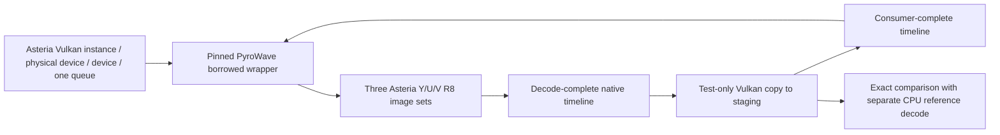

# Stage 3: offline shared-device decode

**OFFLINE ONLY. Surface owner qualification is pending.** This opt-in executable
tests direct decode into caller-owned images. It adds no production renderer,
Session integration, live streaming, YUV-to-RGB shader, video swapchain, overlays,
HDR, frame pacing, or Stage 4/5 work. Existing interop and CPU fallbacks stay intact.
Stage 2's [Surface qualification](QUALIFICATION.md) remains historical evidence.



## Architecture checkpoint

Raw ownership remains the lower-risk choice for this offline proof. Stage 2
already qualifies SDL surface creation and combined queue selection on X1-85.
Stage 3 reuses that owner with a device-only option: no swapchain, framebuffer,
synthetic drawing, or presentation-engine retirement is involved.

The reviewed libplacebo revision `92b5ac6db79f4d680eb656692f7bf51e9606f42a`
supports `pl_vulkan_import`, enabled-feature/queue declarations, callback locks,
`pl_vulkan_wrap`, and `pl_vulkan_hold_ex` / `pl_vulkan_release_ex`. A held texture
allows direct image use with explicit layout and semaphore handoff. Its wrapper
destruction preserves the caller device. That is useful for future presentation,
but it would add another resource owner, required features, texture state and
semaphore retirement to a test that only needs a copy consumer. No libplacebo
alternative is built here. The future presentation decision remains provisional.
See the [reviewed header](https://github.com/haasn/libplacebo/blob/92b5ac6db79f4d680eb656692f7bf51e9606f42a/src/include/libplacebo/vulkan.h#L387).

## Exact source and feature audit

Codec: `186f0393b77f7755953b5ecde994bb1cec2e4155`; bitstream `186f0393`;
C API `0.6.0`; Granite: `b6cffd5ce81f540f0855e6778428483e14763d9b`.
The approved build lock, decoder short-block safety patch and architecture-specific
Granite portability patch are retained. **`runtime_patch=NONE` means no additional
Stage 3 patch**, not an assertion that the approved runtime was built without its
existing recorded patches. No Nonary shared-device/frame-context APIs are used.

Implemented negotiation uses **Vulkan 1.2 plus `VK_KHR_synchronization2` and
`VK_EXT_subgroup_size_control`**, with the feature bits below. This is a tested
policy target, not a claim that 1.2 is the lowest theoretically possible version:
Granite starts at 1.1 and has several extension promotions. We do not impose 1.3
from the header's recommendation. An extension-only 1.1 configuration has not
been implemented or qualified. Stage 2 retains its Vulkan 1.0 synthetic minimum.

| Requirement | Source reason | Core / extension and bit | Fragment output | Compute output | X1-85 support | Enabled here |
|---|---|---|---|---|---|---|
| Timeline semaphore | Positive native acquire/release payloads; Granite submission bookkeeping | 1.2, `VkPhysicalDeviceVulkan12Features.timelineSemaphore` | Yes | Yes | Owner query pending | Yes |
| Synchronization2 | Granite uses `vkQueueSubmit2` and barrier2; context rejects missing extension below 1.3 | 1.3 or KHR; `VkPhysicalDeviceSynchronization2Features.synchronization2` | Yes | Yes | Owner query pending | KHR feature |
| Subgroup BASIC, VOTE, BALLOT, ARITHMETIC, SHUFFLE, SHUFFLE_RELATIVE in compute | Decoder init checks all six; fragment path still uses compute dequantization | 1.1 properties, no enable bit | Yes | Yes | Prior pinned decode is indirect evidence; query pending | Checked |
| Subgroup size control | Decoder checks Granite `supports_subgroup_size_log2(true,2,7)` | 1.3 or EXT; `subgroupSizeControl` | Yes | Yes | Owner query pending | EXT feature |
| Full subgroups | That same Granite check requires full subgroups even for fragment output | `computeFullSubgroups` in same struct | Yes | Yes | Owner query pending | Yes |
| Compatible subgroup range | 4..128 range covering device range, or overlapping range with compute required-size support | Subgroup-size-control properties | Yes | Yes | Owner query pending | Checked, not a feature |
| 8/16-bit storage OR large texel buffers | Decoder's dequant shader STORAGE_MODE 0 uses both buffer storage widths; alternate mode reads texel buffers | 1.2 `storageBuffer8BitAccess`; 1.1 `storageBuffer16BitAccess`; or `maxTexelBufferElements >= 16 Mi` with R8/R16/R32 UINT texel formats | Alternative | Alternative | Owner query pending | Storage bits only when texel fallback unavailable |
| Unformatted storage image writes | `wavelet_dequant.comp` and compute iDWT declare write-only images without format qualifiers | Core `shaderStorageImageWriteWithoutFormat` | Yes, internal dequant | Yes | Owner query pending | Yes |
| Shader float16 | Optional shader variant; FP32 math with packed half storage fallback exists in `dwt_common.h` | 1.2 `shaderFloat16` | Optional | Optional | Not asserted | Disabled |
| Shader int16 arithmetic | Encoder requirement, not used by decoder's texel variant | Core `shaderInt16` | No | No | Not asserted | Disabled |
| Internal R16/R32 SFLOAT sampled/storage images | Wavelet buffers in approved FP32-math / reduced-storage configuration | Format and image support queries | Yes | Yes | Owner query pending | Queried |
| Internal R16 / RG16 SFLOAT sampled color attachments | Fragment iDWT intermediate targets | Format support | Yes | No | Owner query pending | Queried for fragment |
| R8_UNORM caller output | UNORM final planes; transfer source solely for verification | Selected image usage/extent/sample-count query | COLOR_ATTACHMENT + TRANSFER_SRC | STORAGE + TRANSFER_SRC | Owner query pending | Selected path only |

Source locations: [decoder initialization](https://github.com/Themaister/pyrowave/blob/186f0393b77f7755953b5ecde994bb1cec2e4155/pyrowave_decoder.cpp#L994),
[payload fallback](https://github.com/Themaister/pyrowave/blob/186f0393b77f7755953b5ecde994bb1cec2e4155/pyrowave_common.cpp#L241),
[Granite feature inheritance](https://github.com/Themaister/Granite/blob/b6cffd5ce81f540f0855e6778428483e14763d9b/vulkan/context.cpp#L1482),
[Granite subgroup check](https://github.com/Themaister/Granite/blob/b6cffd5ce81f540f0855e6778428483e14763d9b/vulkan/device.cpp#L5834).

## API, ownership and synchronization

`Runtime::borrowDevice` resolves `pyrowave_create_device` and
`pyrowave_device_set_queue_type` only in the opt-in Stage 3 build. It supplies
`pyrowave_device_create_info`, a single `pyrowave_device_create_queue_info`,
both queue callbacks and exact persistent Vulkan create-info storage. After
success it calls `pyrowave_device_get_vk_device_handles` and rejects **any**
instance, physical-device or device inequality. Names and vendor IDs are diagnostics.
Queue mode is GRAPHICS; the selected family supports GRAPHICS, COMPUTE and PRESENT.

`pyrowave_decoder_device_prefers_fragment_path` selects output path through
`createDecoder(...,true)`. No application vendor table exists. Three output sets
contain one optimal-tiled, exclusive, device-local-preferred, single-mip/layer/sample
R8_UNORM image for each plane: 1920x1080 Y and 960x540 U/V. The application creates
no output VkImageViews. `pyrowave_gpu_buffers` describes the native VkImages using
`pyrowave_image_view`: COLOR, identity swizzle, correct dimensions/formats, GENERAL.

An initial caller submission transitions UNDEFINED to GENERAL and signals each
non-exportable timeline at 1. Decode acquires the last consumer payload (initially
1), and releases at the next positive value. Both sync operations contain **zero
external image references**. The release is essential: the exact implementation
flushes queued work when its semaphore is signaled; API return is not completion.
The caller copy submission waits on that actual decode payload, uses a memory
dependency, copies each plane in GENERAL to staging, establishes host visibility,
and signals consumer completion. The offline host waits for that value and
invalidates non-coherent memory before comparing. Slot reuse acquires that exact
consumer value. No host signal substitutes for codec completion.

One nonrecursive mutex is shared by caller queue submissions and codec callbacks.
The caller never holds it across a codec call. Counters record codec/caller lock
balance and callback thread hash, including decoder/wrapper destruction.
The command buffer is reused only after the synchronous offline consumer wait.

Shutdown stops submissions, waits outstanding decode/consumer payloads and drains
the caller device, destroys decoder then borrowed wrapper, then caller images,
staging, semaphores/command pool, then Asteria device/surface/instance/loader.
The pin's `pyrowave_decoder_destroy` advances a frame context; it does not establish
the application's consumer completion. Wrapper destruction drains Granite's device
work without destroying the borrowed handles. Create-info and callback storage
outlive wrapper destruction, including exception paths.

The candidate has no image/sync-object import/export API resolution or use, no
external-memory/semaphore create-info chain, no external queue ownership, and no
D3D resource creation. Its mock binary exposes no external image/sync APIs and
asserts zero CPU-output/default-device calls. The separate default-runtime instance
is explicitly fixture generation and synchronous CPU reference only.

## Verification contract

Two deterministic existing patterns (gradient and BT.709 bars) are encoded by
the exact approved runtime. The same encoded packets are serialized into compatibility
and record framing; sequence range metadata supplies full/limited fixtures as in
existing tests. Three decoder lifetimes and six repetitions per case exercise all
three slots: **144 valid GPU frames**, each preceded by malformed truncation
rejection and valid recovery. Each Y/U/V byte must equal synchronous CPU decode
of that same encoded frame. Per-plane SHA256 values are logged. The older <=8 MAE
contract compares lossy decoded output to encoder input; it does not justify a
tolerance between two decodes of the same frame. Unexpected differences fail.

GPU-free policy/API mocks cover requirements, path usage, plane bounds, bounded
slots, positive payloads/overflow, callback balance/nonrecursion, missing shared
exports, all three handle mismatches, parser/codec errors and recovery, and teardown
without default-device/CPU/external fallback. These are not hardware qualification.
Real fault runs cover borrowed initialization, partial images, successful decode,
multiple slot reuses, and parser rejection. Codec API error injection is confined
to mocks because no safe real-device-loss injection is assumed.

## Confirmed factory cleanup issue — production promotion blocked

At the exact codec pin, `pyrowave_c.cpp:221` allocates `pyrowave_device_opaque`.
The `init_instance` failure at lines **225–226** and `init_device` failure at
**228–229** return `PYROWAVE_ERROR_NO_VULKAN` without deleting it or returning a
handle that the public caller can destroy. The early loader failure at lines
167–168 occurs before allocation and is distinct.

Local x64 public-binary fault injection used the approved runtime SHA256
`62f5b8245cbf5c902222687b1aca2eeb1250cac8928d50baff4db5bcc69027d8`.
A real caller Vulkan 1.0 instance with its matching create-info triggers Granite's
documented minimum-instance rejection before device fields are inspected.
Every call returned -5 with a null wrapper. Four batches of 100 calls increased
private memory by 2,936,832; 2,985,984; 2,990,080; and 2,990,080 bytes.
This corroborates the source's unreachable allocation; private-memory growth is
not an exact allocator inventory. The device-init branch is source-confirmed but
its GPU/device-side allocation consequence has not been measured through this
public binary. Normal successful initialization/teardown must be tested separately.

The smallest proposed same-pin fix is delete-before-return (or local RAII released
only on success) in those two branches. **No fix is applied.** Such a fix would
require owner approval, a separately recorded source patch and SHA256, patched-file
hashes/diff, rebuilds for x64/ARM64, and new runtime SHA256 metadata/artifacts; its
binary provenance would differ even if codec commit/API/bitstream stayed constant.

The offline proof bounds this failure by exiting the test process, without
retrying factory failure. `--factory-fault` reproduces repeated early failures
only in a separate diagnostic process. This does not qualify leak freedom or
safe production failure/retry handling. **Production promotion is blocked pending
owner decision; offline successful-path evidence may still be valid.**

## Owner procedure

Extract the matching architecture's `stage3-owner-*.zip`. No Vulkan loader is
included; System32 Vulkan is used. Run on Surface Pro 11 in Windows PowerShell 5.1
or PowerShell 7:

```powershell
.\pyrowave-vulkan-shared-device-policy-tests.exe
powershell -NoProfile -ExecutionPolicy Bypass -File .\run-stage3-owner-tests.ps1 -Surface
```

The runner resolves its own directory after parameter binding and works from an
unrelated CWD. Surface asserts the executable/package is ARM64 and asserts X1-85
**after normal selection**, never using the name to select a device. For x64 omit
`-Surface`. It verifies PE architecture, runtime pin/SHA256 and package hashes,
runs decode and teardown faults, and writes `stage3-evidence/owner-result.json`
plus each case's JSON/text logs. Return that directory for review.

`overall=API_PASS` means offline API/correctness success only. `SKIP` (exit 77)
means no suitable real GPU/loader; it is never a pass. Missing runtime/API exports,
handle mismatch, codec error, comparison difference, or validation ERROR fails.
Validation and synchronization validation enable when available; absent layers
remain SKIP and do not require installing the SDK. Review all validation warnings.
Neither offline timings nor API-return duration establish performance or latency.

## Automated and hardware evidence

Focused CI builds x64/native ARM64, runs policy/mocks and opt-in real GPU cases,
checks PE machines/imports, packages provenance/notices, tests the packaged runner
under both PowerShell versions from unrelated directories with spaces, and runs
the actual package procedure with PASS or explicit SKIP. Baseline (upstream and
Asteria x64/ARM64), existing PyroWave and Stage 2 workflows run on the same head.
CI links and any real hardware result must refer to that final head. Surface
qualification remains **PENDING** until the owner runs the reviewed package.
