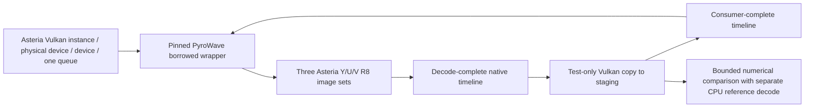

# Stage 3: offline shared-device decode

**OFFLINE ONLY. Stage 3 is complete; final exact-head Surface owner qualification passed.** This opt-in executable
tests direct decode into caller-owned images. It adds no production renderer,
Session integration, live streaming, YUV-to-RGB shader, video swapchain, overlays,
HDR, frame pacing, or Stage 4/5 work. Existing interop and CPU fallbacks stay intact.
Stage 2's [Surface qualification](QUALIFICATION.md) remains historical evidence.



## Architecture checkpoint

Raw ownership remains the lower-risk choice for this offline proof. Stage 2
already qualifies SDL surface creation and combined queue selection on X1-85.
Stage 3 reuses that owner with a device-only option: no swapchain, framebuffer,
synthetic drawing, or presentation-engine retirement is involved.

The reviewed libplacebo revision `92b5ac6db79f4d680eb656692f7bf51e9606f42a`
supports `pl_vulkan_import`, enabled-feature/queue declarations, callback locks,
`pl_vulkan_wrap`, and `pl_vulkan_hold_ex` / `pl_vulkan_release_ex`. A held texture
allows direct image use with explicit layout and semaphore handoff. Its wrapper
destruction preserves the caller device. That is useful for future presentation,
but it would add another resource owner, required features, texture state and
semaphore retirement to a test that only needs a copy consumer. No libplacebo
alternative is built here. The future presentation decision remains provisional.
See the [reviewed header](https://github.com/haasn/libplacebo/blob/92b5ac6db79f4d680eb656692f7bf51e9606f42a/src/include/libplacebo/vulkan.h#L387).

## Exact source and feature audit

Codec: `186f0393b77f7755953b5ecde994bb1cec2e4155`; bitstream `186f0393`;
C API `0.6.0`; Granite: `b6cffd5ce81f540f0855e6778428483e14763d9b`.
The approved build lock, decoder short-block safety patch and architecture-specific
Granite portability patch are retained. The new same-pin borrowed-factory cleanup
patch is recorded separately below, with its source and binary provenance. No Nonary shared-device/frame-context APIs are used.

Implemented negotiation uses **Vulkan 1.2 plus `VK_KHR_synchronization2` and
`VK_EXT_subgroup_size_control`**, with the feature bits below. This is a tested
policy target, not a claim that 1.2 is the lowest theoretically possible version:
Granite starts at 1.1 and has several extension promotions. We do not impose 1.3
from the header's recommendation. An extension-only 1.1 configuration has not
been implemented or qualified. Stage 2 retains its Vulkan 1.0 synthetic minimum.

| Requirement | Source reason | Core / extension and bit | Fragment output | Compute output | X1-85 support | Enabled here |
|---|---|---|---|---|---|---|
| Timeline semaphore | Positive native acquire/release payloads; Granite submission bookkeeping | 1.2, `VkPhysicalDeviceVulkan12Features.timelineSemaphore` | Yes | Yes | Final owner run passed | Yes |
| Synchronization2 | Granite uses `vkQueueSubmit2` and barrier2; context rejects missing extension below 1.3 | 1.3 or KHR; `VkPhysicalDeviceSynchronization2Features.synchronization2` | Yes | Yes | Final owner run passed | KHR feature |
| Subgroup BASIC, VOTE, BALLOT, ARITHMETIC, SHUFFLE, SHUFFLE_RELATIVE in compute | Decoder init checks all six; fragment path still uses compute dequantization | 1.1 properties, no enable bit | Yes | Yes | Final owner run passed | Checked |
| Subgroup size control | Decoder checks Granite `supports_subgroup_size_log2(true,2,7)` | 1.3 or EXT; `subgroupSizeControl` | Yes | Yes | Final owner run passed | EXT feature |
| Full subgroups | That same Granite check requires full subgroups even for fragment output | `computeFullSubgroups` in same struct | Yes | Yes | Final owner run passed | Yes |
| Compatible subgroup range | 4..128 range covering device range, or overlapping range with compute required-size support | Subgroup-size-control properties | Yes | Yes | Final owner run passed | Checked, not a feature |
| 8/16-bit storage OR large texel buffers | Decoder's dequant shader STORAGE_MODE 0 uses both buffer storage widths; alternate mode reads texel buffers | 1.2 `storageBuffer8BitAccess`; 1.1 `storageBuffer16BitAccess`; or `maxTexelBufferElements >= 16 Mi` with R8/R16/R32 UINT texel formats | Alternative | Alternative | Final owner run passed | Storage bits only when texel fallback unavailable |
| Unformatted storage image writes | `wavelet_dequant.comp` and compute iDWT declare write-only images without format qualifiers | Core `shaderStorageImageWriteWithoutFormat` | Yes, internal dequant | Yes | Final owner run passed | Yes |
| Shader float16 | Optional shader variant; FP32 math with packed half storage fallback exists in `dwt_common.h` | 1.2 `shaderFloat16` | Optional | Optional | Not asserted | Disabled |
| Shader int16 arithmetic | Encoder requirement, not used by decoder's texel variant | Core `shaderInt16` | No | No | Not asserted | Disabled |
| Internal R16/R32 SFLOAT sampled/storage images | Wavelet buffers in approved FP32-math / reduced-storage configuration | Format and image support queries | Yes | Yes | Final owner run passed | Queried |
| Internal R16 / RG16 SFLOAT sampled color attachments | Fragment iDWT intermediate targets | Format support | Yes | No | Final owner run passed | Queried for fragment |
| R8_UNORM caller output | UNORM final planes; transfer source solely for verification | Selected image usage/extent/sample-count query | COLOR_ATTACHMENT + TRANSFER_SRC | STORAGE + TRANSFER_SRC | Final owner run passed | Selected path only |

The X1-85 column records successful final owner-run negotiation and decode, not
a separate inventory of every queried property or which storage alternative was used.

Source locations: [decoder initialization](https://github.com/Themaister/pyrowave/blob/186f0393b77f7755953b5ecde994bb1cec2e4155/pyrowave_decoder.cpp#L994),
[payload fallback](https://github.com/Themaister/pyrowave/blob/186f0393b77f7755953b5ecde994bb1cec2e4155/pyrowave_common.cpp#L241),
[Granite feature inheritance](https://github.com/Themaister/Granite/blob/b6cffd5ce81f540f0855e6778428483e14763d9b/vulkan/context.cpp#L1482),
[Granite subgroup check](https://github.com/Themaister/Granite/blob/b6cffd5ce81f540f0855e6778428483e14763d9b/vulkan/device.cpp#L5834).

## API, ownership and synchronization

`Runtime::borrowDevice` resolves `pyrowave_create_device` and
`pyrowave_device_set_queue_type` only in the opt-in Stage 3 build. It supplies
`pyrowave_device_create_info`, a single `pyrowave_device_create_queue_info`,
both queue callbacks and exact persistent Vulkan create-info storage. After
success it calls `pyrowave_device_get_vk_device_handles` and rejects **any**
instance, physical-device or device inequality. Names and vendor IDs are diagnostics.
Queue mode is GRAPHICS; the selected family supports GRAPHICS, COMPUTE and PRESENT.

`pyrowave_decoder_device_prefers_fragment_path` selects output path through
`createDecoder(...,true)`. No application vendor table exists. Three output sets
contain one optimal-tiled, exclusive, device-local-preferred, single-mip/layer/sample
R8_UNORM image for each plane: 1920x1080 Y and 960x540 U/V. The application creates
no output VkImageViews. `pyrowave_gpu_buffers` describes the native VkImages using
`pyrowave_image_view`: COLOR, identity swizzle, correct dimensions/formats, GENERAL.

An initial caller submission transitions UNDEFINED to GENERAL and signals each
non-exportable timeline at 1. Decode acquires the last consumer payload (initially
1), and releases at the next positive value. Both sync operations contain **zero
external image references**. The release is essential: the exact implementation
flushes queued work when its semaphore is signaled; API return is not completion.
The caller copy submission waits on that actual decode payload, uses a memory
dependency, copies each plane in GENERAL to staging, establishes host visibility,
and signals consumer completion. The offline host waits for that value and
invalidates non-coherent memory before comparing. Slot reuse acquires that exact
consumer value. No host signal substitutes for codec completion.

One nonrecursive mutex is shared by caller queue submissions and codec callbacks.
The caller never holds it across a codec call. Counters record codec/caller lock
balance and callback thread hash, including decoder/wrapper destruction.
The command buffer is reused only after the synchronous offline consumer wait.

Shutdown stops submissions, waits outstanding decode/consumer payloads and drains
the caller device, destroys decoder then borrowed wrapper, then caller images,
staging, semaphores/command pool, then Asteria device/surface/instance/loader.
The pin's `pyrowave_decoder_destroy` advances a frame context; it does not establish
the application's consumer completion. Wrapper destruction drains Granite's device
work without destroying the borrowed handles. Create-info and callback storage
outlive wrapper destruction, including exception paths.

The candidate has no image/sync-object import/export API resolution or use, no
external-memory/semaphore create-info chain, no external queue ownership, and no
D3D resource creation. Its mock binary exposes no external image/sync APIs and
asserts zero CPU-output/default-device calls. The separate default-runtime instance
is explicitly fixture generation and synchronous CPU reference only.

## Verification contract

Two deterministic existing patterns (gradient and BT.709 bars) are encoded by
the exact approved runtime. The same encoded packets are serialized into compatibility
and record framing; sequence range metadata supplies full/limited fixtures as in
existing tests. Three decoder lifetimes and six repetitions per case exercise all
three slots: **144 valid GPU frames**, each preceded by malformed truncation
rejection and valid recovery, in EACH of AUTO and FORCE_COMPUTE. Every Y/U/V
byte must satisfy `abs(GPU - CPU) <= 1` against synchronous CPU decode of the
same encoded frame. A single difference of 2 fails; mismatch percentage has no
acceptance threshold. Exact hashes/equality remain diagnostic fields. Six reuse
decodes also require identical GPU hashes across the three slots. Out-of-bound
failures record frame, pattern, framing, range, plane, offset and CPU/GPU values,
including a first-out-of-tolerance sample independently of the first 32 mismatches.
This bound is separate from the older encoder-input-versus-lossy-output MAE test.

GPU-free policy/API mocks cover requirements, path usage, plane bounds, bounded
slots, positive payloads/overflow, callback balance/nonrecursion, missing shared
exports, all three handle mismatches, parser/codec errors and recovery, and teardown
without default-device/CPU/external fallback. These are not hardware qualification.
Real fault runs cover borrowed initialization, partial images, successful decode,
multiple slot reuses, and parser rejection. Codec API error injection is confined
to mocks because no safe real-device-loss injection is assumed.

## Same-pin borrowed-factory cleanup safety patch

The independently confirmed leak at pinned `pyrowave_c.cpp:221–229` is now fixed
by [0004-borrowed-factory-cleanup.patch](../../../scripts/pyrowave/patches/0004-borrowed-factory-cleanup.patch).
The only changes are `delete dev` before the two `PYROWAVE_ERROR_NO_VULKAN`
returns from `init_instance` / `init_device` failure. Loader failure still occurs
before allocation; successful construction, API, ownership, codec pin and bitstream
are unchanged. Patch SHA256:
`8fe5906706bb27814ed7344f8932cd5ccf00c368ed24d253839d13cfeeb78c86`.

The previous real ARM64 fault diagnostic reported approximately 2.9–3.1 MB private
growth per 100 failed calls. That is historical supporting evidence, not an exact
allocator inventory. New builds compile the ACTUAL patched factory and destroy
function bodies extracted from pinned source, with instrumented Context/Device
substitutes. Each of 10,000 loader, instance and device failure calls verifies the
unchanged public error and null output; all allocated wrappers are destroyed.
Another 10,000 successful create/destroy calls verify callbacks and balanced
ownership: 30,000 allocations, 30,000 destructions, zero live wrappers.
The test does not simulate the entire Vulkan driver or Granite implementation.
Granite's [borrowed factory ownership flags](https://github.com/Themaister/Granite/blob/b6cffd5ce81f540f0855e6778428483e14763d9b/vulkan/context.cpp#L161)
preserve caller handles during context cleanup. Successful native hardware decode
and teardown remain required separately.

Every architecture runtime build must pass this test before staging. The package
contains its executable, `factory-ownership.json`, patch and runtime manifest,
recording patch SHA, patched/extracted source hashes, test binary hash and runtime
SHA. The owner runner verifies that evidence and reruns the deterministic test.
It then requires 400 public factory-fault calls to return -5/null on the real loader.
Private-memory movement remains supporting data; exact equality is not a gate.
`factoryCleanup=PATCHED_AND_VERIFIED` requires BOTH the deterministic source test
and successful public fault diagnostic. Production promotion and Stage 4 remain
unauthorized; removing this leak does not authorize either.

## Owner procedure

Extract the matching architecture's `stage3-owner-*.zip`. No Vulkan loader is
included; System32 Vulkan is used. Run on Surface Pro 11 in Windows PowerShell 5.1
or PowerShell 7:

```powershell
.\pyrowave-vulkan-shared-device-policy-tests.exe
powershell -NoProfile -ExecutionPolicy Bypass -File .\run-stage3-owner-tests.ps1 -Surface -DiagnosticDeviceIdle
```

The runner resolves its own directory after parameter binding and works from an
unrelated CWD. Surface asserts the executable/package is ARM64 and asserts X1-85
**after normal selection**, never using the name to select a device. For x64 omit
`-Surface`. It verifies PE architecture, runtime pin/SHA256 and package hashes,
runs the targeted diagnostic automatically on Surface, and writes
`stage3-evidence/owner-result.json` plus mode, repeat and comparison JSON/logs.
Return that directory, including bounded `.bin` plane dumps, for review.
The broader AUTO and forced-compute 144-frame suites run only if both targeted
paths satisfy the numerical and stability gates. The factory diagnostic also runs
after a completed failure diagnosis. All evidence is required for final PASS.

`overall=API_PASS` means offline API/correctness success only. `SKIP` (exit 77)
means no suitable real GPU/loader; it is never a pass. Missing runtime/API exports,
handle mismatch, codec error, out-of-tolerance comparison, unstable hashes, idle-changed output, or validation ERROR fails.
Validation and synchronization validation enable when available; absent layers
remain SKIP and do not require installing the SDK. Review all validation warnings.
Neither offline timings nor API-return duration establish performance or latency.

## Automated and hardware evidence

Focused CI builds x64/native ARM64, runs policy/mocks and opt-in real GPU cases,
checks PE machines/imports, packages provenance/notices, tests the packaged runner
under both PowerShell versions from unrelated directories with spaces, and runs
the actual package procedure with PASS or explicit SKIP. Baseline (upstream and
Asteria x64/ARM64), existing PyroWave and Stage 2 workflows run on the same head.
CI links and any real hardware result must refer to that final head. The final
Surface owner qualification below supersedes the earlier exact failures, which
remain historical evidence.

### Final exact-head Surface owner qualification

Surface Pro 11 / Snapdragon X Plus / Adreno X1-85 / native Windows ARM64 passed
with **`PASS_NUMERIC_EQUIVALENCE_OWNER_RUN`** on
`a3cf6b0c59db9465d01178900cd954390728363f`.
[PR #36](https://github.com/Unitron07/Asteria-Windows/pull/36) merged via
`06ea4adb745432842af81b73549f74c696fa5a39`.

AUTO selected fragment and FORCE_COMPUTE selected compute on the same
Asteria-owned Vulkan instance / physical device / device / queue. Both passed
`abs(GPU_BYTE - CPU_BYTE) <= 1` for every tested Y/U/V byte, including each
144-frame shared-device suite with three output slots, three decoder lifetimes
and malformed-frame recovery. Maximum observed absolute error was 1; exact
equality remained diagnostic. Repeat hashes were stable and diagnostic
`vkDeviceWaitIdle` changed zero output bytes.

Borrowed handle identities matched; outputs were native caller-owned R8 Y/U/V
images with positive timeline synchronization. External-memory handles,
external-semaphore handles and D3D11 resources were all zero. Factory cleanup
reported `PATCHED_AND_VERIFIED`. The final aggregate reported `overall=API_PASS`
and `stage3Qualification=PASS_NUMERIC_EQUIVALENCE`.

Vulkan validation remained **`SKIP`**, because the validation layer was unavailable;
it was not a validation PASS. The precise arithmetic cause of the observed ±1
differences remains unproven. This qualifies offline shared-device decode only:
no Stage 4, live presentation, YUV-to-RGB shader or video swapchain was included.

The next step is **Stage 4: native Vulkan YUV-to-RGB presentation and swapchain
work**, separately implemented and qualified.

## Initial Surface owner failure (reported by owner)

At source revision `88420c037c786f280e7de5d074c2516a2d9cc83b`, Surface Pro 11 /
Snapdragon X Plus / Qualcomm Adreno X1-85 / native Windows ARM64 selected the
codec's recommended **fragment** path. Instance, physical-device and device
handles all matched exactly. Native caller-owned R8 Y/U/V output, timeline
handoff and Vulkan readback were reached with zero external-memory handles,
zero external-semaphore handles, zero D3D11 resources, and no external-handle API.

The first valid comparison failed: frame 0, lifetime 0, gradient, compatibility
framing, full range, Y plane 0. CPU SHA256:
`be612e37407051e3cf8e2ad21491b15bfa54956877ed8e6b61dda7b1eb08f150`;
GPU SHA256:
`27fa2560bd2c2a318faf6ab7c51aaf0aac13209b629cdafa277f309c85a6a0bc`.
Result **FAIL**, validation **SKIP**. Hash inequality alone does not establish
error magnitude, spatial distribution, repeatability, or the root cause.
Raw owner plane bytes were not supplied with this continuation request.
The independent factory leak was confirmed at that revision; the new safety patch is separate from the numerical policy.

The same revision's RTX 4070 Ti x64 compute result remains historical evidence:
144 valid frames, 432 exact plane comparisons, three slots, three decoder
lifetimes, malformed rejection/recovery, matching borrowed handles, no external
handles. It does not qualify the failing X1-85 fragment output.

## Diagnostic revision and result contract

`--force-compute` uses the existing pinned `fragment_path=false` create-info
field; AUTO still follows `pyrowave_decoder_device_prefers_fragment_path`.
The recommendation is logged independently of the actual path. No vendor table,
CPU candidate output or default candidate device is added. The approved numerical gate and separate factory safety patch are explicitly recorded.

Surface mode invokes `--diagnostic-suite`: both modes use the SAME Asteria
instance/physical/device/queue and the SAME encoded fixtures generated once.
Borrowed wrappers are recreated per mode to preserve decoder -> wrapper -> output
resource destruction order. Output support is queried for each actual path:
AUTO fragment uses 17 (COLOR_ATTACHMENT + TRANSFER_SRC); compute uses 9
(STORAGE + TRANSFER_SRC). Three image sets stay bounded; diagnostic repeats use
slot 0 and the identical fixture. The original 144-frame suite remains intact.

Seven targeted fixtures: low (Y=16), mid (128), high (235), existing horizontal
gradient and BT.709 bars in compatibility/full framing; the same gradient with
limited metadata; and its packet payload in record framing. U/V constants are
128 except the existing bars. Encoded hashes identify identical inputs across
modes. All three planes are compared before a case fails.

Per-plane JSON records byte/mismatch counts and percentage, CPU/GPU extrema,
maximum/mean absolute error, nine signed GPU-minus-CPU histogram buckets,
first/last offsets, up to 32 x/y/value samples, border counts, affected rows,
longest equal/unequal linear runs, and quadrant counts. The first failing frame
per mode dumps all three CPU/GPU planes and metadata (about 6 MiB per mode),
never every repeated frame. CPU vs AUTO, CPU vs forced compute, and AUTO vs
forced compute are all recorded; the latter labels its left/right outputs.

Every fixture/path is decoded four more times on slot 0 without
prefill or added idle. Five hashes per plane classify `repeat_hash_stable`.
Surface then runs a separate optional prefill experiment with 165 and 90:
new diagnostic images add TRANSFER_DST (19/11), re-query support and synchronize
the clear with positive timeline payloads. Baseline images retain 17/9. Counts
of the sentinel and sentinel bytes unequal to CPU are evidence candidates,
not proof of unwritten output: legal decoded pixels may coincide, and the
codec's DONT_CARE render-pass load can discard prior contents.

`-DiagnosticDeviceIdle` adds a clearly labeled experiment after codec submission
and before readback, comparing normal/idle bytes on each fixture/path. It is
never the normal synchronization architecture. For an x64 diagnostic run use
`-Diagnostic`; `-DiagnosticPrefill` enables its optional clear experiment.

Evidence: `auto-fragment.json/log` (filename denotes AUTO, actual path is explicit),
`forced-compute.json/log`, `repeatability.json/log`, `cross-comparison.json`,
`diagnostic-summary.json`, `diagnostic-suite.json/log`, plane dumps, factory
status, runtime provenance, and `owner-result.json`. A completed investigation
reports **DIAGNOSTIC_COMPLETE** before aggregate qualification. Targeted success
is `TARGETED_NUMERIC_EQUIVALENCE_FULL_SUITE_PENDING`; final success after both
full suites, all five lifetime faults and factory cleanup is
`stage3Qualification=PASS_NUMERIC_EQUIVALENCE`. `exact_equal=false` with
`numerically_equivalent=true`, `stage3_tolerance=1`, `max_absolute_error=1` is
a valid PASS. Numerical failure is path-neutral `FAIL_GPU_OUTPUT_TOLERANCE`;
non-bitexact output alone is informational. AUTO versus FORCE_COMPUTE is diagnostic
and need not be identical, or satisfy the CPU-reference bound against each other.
The runner independently rejects a claimed successful summary with max error >1,
invalid per-plane metrics, unstable repeats, changed idle output, device/fixture/
ownership/path/timeline violations or a failed child process. PS5.1/7 fixtures
exercise bounded non-bitexact PASS plus these failures, with default/custom roots.

`owner-result.json` exposes architecture/GPU/source/runtime hash and provenance,
actual paths, identity/zero external resources, each mode's exact and numerical
verdicts/max errors, repeat stability, idle-change status, factory cleanup,
validation and final qualification at top level. Validation unavailable stays SKIP.
For reproduction or future qualification, return the entire fresh evidence
directory. PR #36 is merged; its completed exact-head Surface qualification is
recorded above. A future source/runtime revision requires its own qualification.

## Owner-reported dual-path evidence and approved portable contract

The owner ran diagnostic head `f08ecabb74e4e8f3270c4f00fa77634fb24f6ad6` on
Surface Pro 11 / Snapdragon X Plus / Qualcomm Adreno X1-85 / native ARM64.
AUTO selected fragment; forced compute used compute on the SAME Asteria caller
device and encoded fixtures. Both were non-bitexact against CPU, and non-bitexact
against each other. Repeat hashes were stable; diagnostic device idle did not
change bytes; native caller-owned R8 outputs and positive timeline readback worked,
with no external memory/semaphore handles, external path or D3D11 resources.
Validation was SKIP. These are owner-reported measurements; raw new files were
not supplied with the request.

| Fixture / Y plane | AUTO fragment differing bytes | Forced compute differing bytes | Max error |
|---|---:|---:|---:|
| Gradient compatibility/full (2,073,600 bytes) | 101,723 (~4.9056%) | 110,473 (~5.3276%) | 1 |
| Flat low (16 → 17) | 4,020 (~0.1939%) | 308,045 (~14.8556%) | 1 |

Gradient U/V were exact; differing bars planes also showed only ±1. Thus the
earlier `FAIL_FRAGMENT_MISMATCH` diagnosis was misleading: differences occur
in both legitimate paths. Current evidence supports deterministic bounded
numerical reconstruction variants, consistent with pinned upstream validation.
It does not prove a Qualcomm instruction, mediump implementation, rounding rule
or conversion rule as the precise cause, or indicate corruption/synchronization
failure without additional evidence.

Independently inspected at exact pin:
[device validation lines 153–168](https://github.com/Themaister/pyrowave/blob/186f0393b77f7755953b5ecde994bb1cec2e4155/pyrowave_device_validation.cpp#L153)
accepts maximum 1 luma code value and 2 for chroma in roundtrip validation;
[Vulkan interop validate_mirror_buffer lines 446–456](https://github.com/Themaister/pyrowave/blob/186f0393b77f7755953b5ecde994bb1cec2e4155/pyrowave_c_interop_test.cpp#L446)
requires `abs(reference - decoded) <= 1`. This upstream tolerance model, plus
the owner's explicit authorization, supports distinguishing portable numerical
equivalence from exact identity. Asteria deliberately chooses the conservative
**±1 for EVERY Y/U/V byte**. There is no mismatch-percentage relaxation: even
15% differing by exactly one passes; one byte differing by two fails. Device,
ownership, lifetime, synchronization, determinism, recovery and validation gates
remain hard requirements.

## Readback re-audit

The actual positive codec release payload is waited by the caller queue submit
at ALL_COMMANDS. Its signal makes codec writes available; the wait makes them
visible. The existing explicit producer barrier includes COLOR_ATTACHMENT_OUTPUT /
COLOR_ATTACHMENT_WRITE for fragment and COMPUTE_SHADER / SHADER_WRITE for
compute, followed by TRANSFER / TRANSFER_READ. Images stay GENERAL, legal for
the copy source. Each plane has its own exact-size staging buffer, offset zero,
rowLength/imageHeight zero (tightly packed), mip/layer zero and exact 1920x1080
or 960x540 extent. Transfer writes are made visible to HOST reads; the actual
consumer timeline is host-waited before map/read and command-buffer reset.
Non-coherent allocations are mapped and invalidated over VK_WHOLE_SIZE, then
unmapped. Reuse acquires the recorded consumer payload, never an inferred
completion. No normal per-frame DeviceWaitIdle was added; the original final
teardown drain remains. This review finds no concrete readback defect, but cannot
rule out a driver/path issue without new hardware measurements.

## Pinned fragment-output source findings

The [fragment shader](https://github.com/Themaister/pyrowave/blob/186f0393b77f7755953b5ecde994bb1cec2e4155/shaders/idwt.frag#L23)
declares `mediump` floating outputs and sampled inputs. Its CDF 9/7 synthesis
sum (lines 224-238) is written as float, with final Y/CbCr +0.5 shifts (240-251).
There is no explicit byte rounding or dithering in this output shader. Float
output reaches the caller's R8_UNORM color attachment through fixed-function
conversion. The [compute shader](https://github.com/Themaister/pyrowave/blob/186f0393b77f7755953b5ecde994bb1cec2e4155/shaders/idwt.comp#L82)
uses separable lifting steps and `imageStore` (203-213), also to UNORM; it does
NOT implement an explicit integer quantizer that guarantees equality to fragment.
The arithmetic/filter evaluation and intermediate layout differ, so final UNORM
conversion is not the only numerical difference that must be considered.

[Fragment output conversion](https://docs.vulkan.org/spec/latest/chapters/interfaces.html#interfaces-fragmentoutput)
uses the specification's float-to-normalized conversion. The
[conversion rule](https://docs.vulkan.org/spec/latest/chapters/fundamentals.html#fundamentals-fp-conversion)
clamps to [0,1], scales by 255 for eight bits, and permits either of the two closest
integer values; nearest rounding is recommended. It does not mandate a particular
half-LSB tie break. This permits numerical differences; it does not prove the
reported Surface mismatch is rounding, and is not the basis of the approved acceptance bound by itself.

The [decoder render passes](https://github.com/Themaister/pyrowave/blob/186f0393b77f7755953b5ecde994bb1cec2e4155/pyrowave_decoder.cpp#L441)
store enabled attachments, bind caller views at final output, use opaque sprite
state, and split edge scissors plus 420 render-area fixups (535-666). The
[Granite opaque state](https://github.com/Themaister/Granite/blob/b6cffd5ce81f540f0855e6778428483e14763d9b/vulkan/command_buffer.cpp#L4276)
disables blending. Its [render-pass defaults](https://github.com/Themaister/Granite/blob/b6cffd5ce81f540f0855e6778428483e14763d9b/vulkan/render_pass.cpp#L157)
select DONT_CARE load and STORE when the store mask is set. The Stage 3 view
and image formats are both R8_UNORM with identity swizzle. No decoder dithering
flag or shader noise was found in this audited path. Viewport/scissor/fixup
correctness on X1-85 is not proven by source reading; the spatial metrics and
prefill experiment specifically probe it. The precise numerical root cause remains unproven; new dual-path owner evidence supports the bounded conclusion above.
